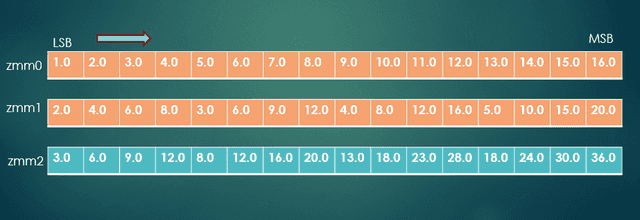
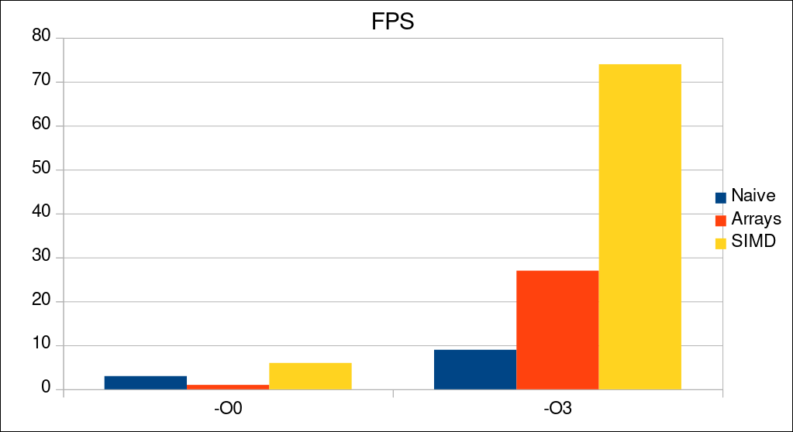
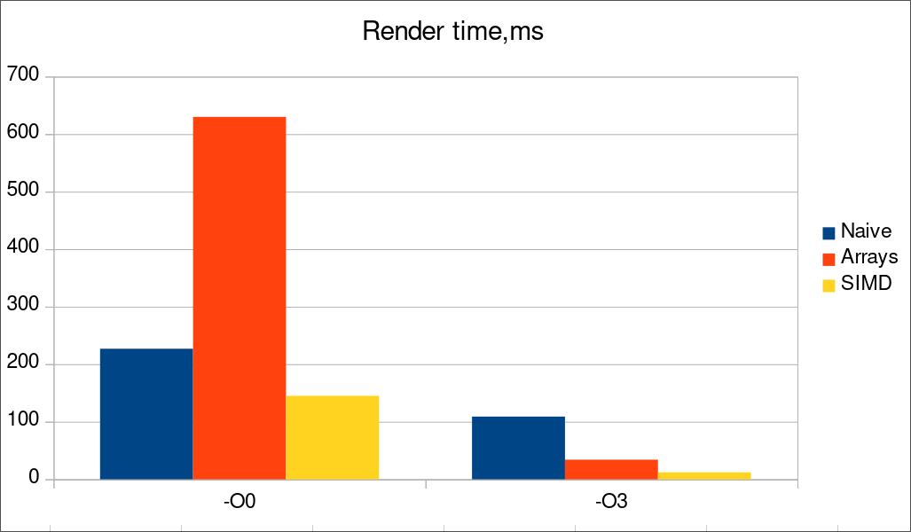

# Рендеринг множества Мандельброта с использованием векторных инструкций

## Введение 
Данный проект реализует несколько из возможных способов рендера двумерных фрактальных фигур (в частности множества Мандельброта). Целью работы является исследование влияния SIMD оптимизаций на скорость отрисовки изображения.

## Скачивание и установка

> [!IMPORTANT]
> Эта программа предназначена для исполнения на системах с архитектурой x86_64 tigerlake и Linux в качестве ОС. Стабильная работа при ручном изменении параметров компиляции (или запуске на системах с другой архитектурой / ОС) не гарантируется.

Для скачивания и сброрки программы в примере ниже используются утилиты [`git`](https://git-scm.com/), [`cmake`](https://cmake.org/) и [`ninja`](https://ninja-build.org/). Допускается изменение системы сборки `ninja` на любую другую, поддерживаемую CMake, при помощи параметра командной строки `-G <generator name>`. Для корректного функционирования и сборки программы необходима установленная на компьютере библиотека [`sfml`](https://www.sfml-dev.org/index.php).

``` bash
> git clone git@github.com:Iprime111/Mandelbrot.git
> cd Mandelbrot
> mkdir build && cd build
> cmake .. -DCMAKE_BUILD_TYPE=Release -GNinja
> ninja
```

Собранная программа находится по адресу `.../bin/Mandelbrot`

## Внешний вид и горячие клавиши
Интерфейс запущеной программы включает в себя информацию о:
1) *Текущем* и *среднем* значениях **времени рендера кадра**
2) *Текущем* и *среднем* значениях **времени отрисовки кадра**
3) Выбранном **методе рендера**


В программе присутствует возможность динамической смены метода отрисовки и раскраски множества, а также поддерживается перемещение и изменение масштаба фигуры.

> [!NOTE]
> При отрисовке изображения на GPU смена раскраски недоступна для оптимизации отрисовки

Ниже приведен список горячих клавиш, используемых программой:

Клавиша|Действие
:-----:|:-------
W / ↑  | Сдвиг вверх
S / ↓  | Сдвиг вниз
A / ←  | Сдвиг влево
D / →  | Сдвиг вправо
\+     | Увеличение изображения
\-     | Уменьшение изображения
J      | Предыдущий метод рендера
K      | Следующий метод рендера
H      | Предыдущая раскраска
L      | Следующая раскраска

## Векторные инструкции

В работе широко применяются SIMD инструкции (single instruction multiple data), работающие со специальными регистрами (xmm, ymm, zmm), способными хранить до 512 бит (16 значений типа `float` или `uint32_t`). С их помощью возможно за существенно меньшее количество тактов выполнять различные операции с несколькими значениями одновременно. Ниже размещено изображение, демонстрирующее работу операции сложения чисел с плавающей точкой для двух 512-битных регистров (`_mm512_add_ps` в Intel intrinsics guide) :

\
*[Источник](https://www.physicsforums.com/insights/an-intro-to-avx-512-assembly-programming/)*

### Intrinsic функции
Во многих современных компиляторах (gcc, clang) доступны так называемые intrinsic функции, реализация которых подставляется непосредственно при сборке программы. Такой подход позволяет интегрировать ассемблерные инструкции в код программы, сохраняя при этом читаемость и структуру кода на высокоуровневом языке. Зачастую, данные функции являются платформозависимыми и предоставляют интерфейс для использования векторных инструкций в коде на C/C+
### Выбор набора инструкций
Так как разработка ведется целенаправленно под архитектуру **x86_64 tigerlake**, в качестве набора SIMD инструкций был выбран `avx-512` (advanced vector extensions). Он позволяет производить вычисления с использованиям 512-битовых регистров, что в теории дает прирост производительности до 16 раз. В реальности столь сильный выигрыш не может быть получен. Причинами этого являются невозможность векторизации всего кода и более долгое выполнение одной SIMD инструкции в сравнении с обычной.

## Обзор методов отрисовки
На выбор пользователю доступны 4 метода отрисовки изображения:

### Наивный рендеринг на процессоре
Данная реализация использует двойной цикл для прохода по каждому из пикселей изображения и выбора цвета. Ниже представлен псевдокод алгоритма отрисовки:

```
for pixelY in [0, SCREEN_HEIGHT]:
    for pixelX in [0, SCREEN_WIDTH]:
        x0 = PixelToCoordinates (pixelX)
        y0 = PixelToCoordinates (pixelY)

        xN = x0
        yN = y0
        while iterations < MAX_ITERATIONS:
            x2 = xN ^ 2
            y2 = yN ^ 2
            xy = xN * yN

            if x2 + y2 < MAX_RADIUS ^ 2:
                break

            xN = x2 - y2 + x0
            yN = 2 * xy  + y0
            
            iterations++;
        
        Pixels [x][y] = GetColor (iterations);
```

Здесь `Pixels` - массив цветов пикселей окна, `SCREEN_WIDTH` и `SCREEN_HEIGHT` - ширина и высота окна соответственно, `MAX_ITERATIONS` - максималбно допустимое количество итераций внутреннего цикла, `MAX_RADIUS` - радиус окружности, в которой должна лежать точка множества после всех преобразований координат, `PixelToCoordinates()` - функция, преобразующая координаты на экране в координаты на рассматриваемой плоскости, `GetColor()` - функция раскраски множества

### Рендеринг с оптимизациями на массивах
Данный алгоритм приближен к наивной реализации, однако, в отличие от нее, использует массивы для отрисовки групп по 16 пикселей, что позволяет компилятору с флагом `-O3` использовать SIMD оптимизации, ускоряющие выполнение кода.

> [!NOTE]
> Длина массива в 16 чисел была выбрана исходя из размера zmm регистра в 512 бит

### Рендеринг с использованием SIMD intrinsic
В этом варианте функции отрисовки используются `avx-512` intrinsic функции, что обеспечивает большую оптимизацию, чем при неявном использовании SIMD инструкций компилятором.

### Рендеринг на видеокарте
Использует glsl шейдер, выполняющий алгоритм отрисовки. Такой подход позволяет ускорить исполнение в несколько тысяч раз. В данной работе алгоритм отрисовки на GPU представлен лишь для сравнения и не подвергался тщательному анализу.

## Методика измерений

### Выбор способа измерения времени
Для измерения времени рендера текстуры и отрисовки кадра применяется intrinsic функция [`__rdtsc()`](https://www.laruence.com/sse/#text=_rdtsc%20(void)&expand=4545). Она позволяет получить значение регистра `TSC` (time stamp counter), который содержит в себе количество тактов, прошедшее с момента включения компьютера.

### Оценка точности

Основываясь на результатах исследования, доступного по [ссылке](https://github.com/testing-laboratory/rdtscTest), можно заметить, что погрешность, вносимая инструкцией `rdtsc` пренебрежимо мала, составляя ~18 тактов процессора.\
Так как счетчик `TSC` не зависит от тактовой частоты процессора, основная погрешность измерения вносится прерываниями, вызванными работой других процессов. Такую погрешность можно считать случайной и оценить по набору снятых данных. 

### Возможные альтернативы
Альтернативным методом измерения времени (в POSIX совместимых системах) может являться функция `clock_gettime()` с параметром `CLOCK_PROCESS_CPUTIME_ID`. Она позволяет измерить время, задействованное конкретным процессом, однако имеет меньшее разрешение по времени и зависит от тактовой частоты процессора, вследствие чего не была выбрана.

##  Измерения и обработка данных
Ниже приведены таблицы с результатами средних значений FPS и времени рендера кадра (без вывода на экран) для каждого из методов при разных оптимизациях. Каждое из значений измерялось 4 раза (запуска программы) с последующим усреднением результатов. При каждом из измерений масштаб изображения и положение камеры были одинаковыми. Для снятия средних значений был использован размер выборки в 300 циклов отрисовки. Все замеры проводились в приближенных условиях (близкие частоты и температуры CPU) с минимально возможной фоновой активностью:

### Время отрисовки кадра (в тиках процессора)

Уровень оптимизации / Метод рендера | Naive | Array | SIMD |
------------------------------------|-------|-------|------|
`-O0`                               | 1818348800 | 4865328000 | 1087955100 |
`-O3`                               | 898304500 | 236214300 | 78613200 |



### Время рендера текстуры (в тиках процессора)

Уровень оптимизации / Метод рендера | Naive | Array | SIMD |
------------------------------------|-------|-------|------|
`-O0`                               | 1818179400 | 4865328000 | 1087955100 |
`-O3`                               | 898143300 | 233768400 | 78524400 |



## Оценка погрешностей
В данной работе не имеет смысла точный подсчет погрешностей, так как они (как и сами результаты) зависят от заряда батареи, наличия питания, количества системных процессов и многих других факторов, учесть которые представляется невозможным. В связи с этим была произведена верхняя оценка значения случайной погрешности (так как измерительная погрешность пренебрежимо мала, что было показано выше). 

Случайная погрешность в различных сериях значений составила `~10^6` тиков или примерно `0.2%` (оценка сверху) при доверительной вероятности 0.95. Опираясь на эти данные, можно утверждать, что измерения, приведенные выше, репрезентативны и могут служить основой для последующих выводов.

### Оценка влияния функций отрисовки
Анализируя значения, приведенные в таблицах выше, нетрудно заметить, что разница времен отрисовки кадра и рендера кадра без отрисовки составляет ~10^5 тиков процессора, что укладывается в рамки рассматриваемой погрешности. В связи с этим предлагается не включать данные величины в рассчеты.

### Возможные улучшения
Для получения еще меньшей погрешности необходимо обеспечить независимость процесса, проводящего измерения от остальных, в том числе и системных. Для этого предлагается использование операционных систем реального времени, позволяющих закрепить конкретное логическое ядро за одним процессом и запустить его с постоянной тактовой частотой. При этом важно обеспечить стабильность температуры процессора и скорости работы диска, оперативной памяи и остальных комплектующих. Такой подход позволит уменьшить погрешность до пренебрежимо малых значений и улучшить полученные результаты.

## Выводы

Из гистограмм видно, что без флага `-O3` компилятор не использует SIMD инструкции, из-за чего реализация рендера на массивах работает медленнее наивной. Также четко заметно, что при обоих уровнях оптимизации, использование intrinsic функций повышает производительность (в ~2.0 раза на `-O0` и в ~8.2 раза на `-O3` по сравнению с нативной реализацией). Таким образом, показано, что использование SIMD инструкций явно (при помощи intrinsic функций) способно многократно повысить производительность в хорошо параллелизируемых задачах. Также результаты показывают неспособность компилятора `gcc` полностью оптимизировать код, написанный без intrinsic функций или ассемблерных вставок. Этот факт еще раз подчеркивает важность явных оптимизаций в коде на высокоуровневых языках.


