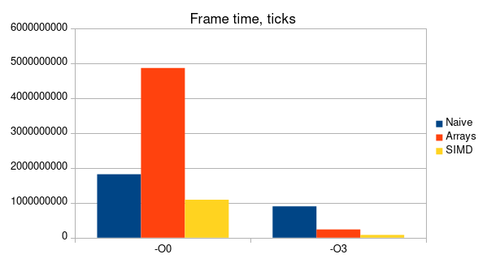

# Рендеринг множества Мандельброта с использованием векторных инструкций

## Введение 
Данный проект реализует несколько из возможных способов рендера двумерных фрактальных фигур (в частности множества Мандельброта). Целью работы является исследование влияния SIMD оптимизаций на скорость отрисовки изображения.

## Скачивание и установка

> [!IMPORTANT]
> Эта программа предназначена для исполнения на системах с архитектурой x86_64 tigerlake и Linux в качестве ОС. Стабильная работа при ручном изменении параметров компиляции (или запуске на системах с другой архитектурой / ОС) не гарантируется.

Для скачивания и сброрки программы в примере ниже используются утилиты [`git`](https://git-scm.com/), [`cmake`](https://cmake.org/) и [`ninja`](https://ninja-build.org/). Допускается изменение системы сборки `ninja` на любую другую, поддерживаемую CMake, при помощи параметра командной строки `-G <generator name>`. Для корректного функционирования и сборки программы необходима установленная на компьютере библиотека [`sfml`](https://www.sfml-dev.org/index.php).

``` bash
> git clone git@github.com:Iprime111/Mandelbrot.git
> cd Mandelbrot
> mkdir build && cd build
> cmake .. -DCMAKE_BUILD_TYPE=Release -GNinja
> ninja
```

Собранная программа находится по адресу `.../bin/Mandelbrot`

## Внешний вид и горячие клавиши
Интерфейс запущеной программы включает в себя информацию о:
1) *Текущем* и *среднем* значениях **времени рендера кадра**
2) *Текущем* и *среднем* значениях **времени отрисовки кадра**
3) Выбранном **методе рендера**


В программе присутствует возможность динамической смены метода отрисовки и раскраски множества, а также поддерживается перемещение и изменение масштаба фигуры.

> [!NOTE]
> При отрисовке изображения на GPU смена раскраски недоступна для оптимизации отрисовки

Ниже приведен список горячих клавиш, используемых программой:

Клавиша|Действие
:-----:|:-------
W / ↑  | Сдвиг вверх
S / ↓  | Сдвиг вниз
A / ←  | Сдвиг влево
D / →  | Сдвиг вправо
\+     | Увеличение изображения
\-     | Уменьшение изображения
J      | Предыдущий метод рендера
K      | Следующий метод рендера
H      | Предыдущая раскраска
L      | Следующая раскраска

## Векторные инструкции

В работе широко применяются avx инструкции (advanced vector instructions), работающие со специальными регистрами (xmm, ymm, zmm), способными хранить до 512 бит (16 значений типа `float` или `uint32_t`). С их помощью возможно за существенно меньшее количество тактов выполнять арфиметические, логические и некоторые другие операции с несколькими значениями одновременно. Ниже размещено изображение, демонстрирующее работу операции сложения для двух 256-битных регистров:


*Источник: https://www.codingame.com/playgrounds/283/sse-avx-vectorization/what-is-sse-and-avx*

## Обзор методов отрисовки
На выбор пользователю доступны 4 метода отрисовки изображения:

### Наивный рендеринг на процессоре
Данная реализация использует двойной цикл для прохода по каждому из пикселей изображения и выбора цвета. Ниже представлен псевдокод алгоритма отрисовки:

```
for pixelY in [0, SCREEN_HEIGHT]:
    for pixelX in [0, SCREEN_WIDTH]:
        x0 = PixelToCoordinates (pixelX)
        y0 = PixelToCoordinates (pixelY)

        xN = x0
        yN = y0
        while iterations < MAX_ITERATIONS:
            x2 = xN ^ 2
            y2 = yN ^ 2
            xy = xN * yN

            if x2 + y2 < MAX_RADIUS ^ 2:
                break

            xN = x2 - y2 + x0
            yN = 2 * xy  + y0
            
            iterations++;
        
        Pixels [x][y] = GetColor (iterations);
```

### Рендеринг с оптимизациями на массивах
Данный алгоритм приближен к наивной реализации, однако, в отличие от нее, использует массивы для отрисовки групп по 16 пикселей, что позволяет компилятору с флагом `-O3` использовать SIMD оптимизации, ускоряющие выполнение кода.

### Рендеринг с использованием SIMD intrinsic
В этом варианте функции отрисовки используются avx512 intrinsic методы, позволяющие производить действия с 16 значениями при помощи одной инструкции, что обеспечивает большую оптимизацию, чем при неявном использовании avx512 инструкций компилятором.

### Рендеринг на фидеокарте
Использует glsl шейдер, выполняющий алгоритм отрисовки. Такой подход позволяет ускорить исполнение в несколько тысяч раз. В данной работе алгоритм отрисовки на GPU представлен лишь для сравнения и не подвергался тщательному анализу.

## Методика измерений

### Выбор способа измерения времени
Для измерения времени рендера текстуры и отрисовки кадра применяется ассемблерная вставка, использующая инструкцию `rdtsc`. Она позволяет получить значение регистра `TSC` (time stamp counter), который содержит в себе количество тактов, прошедшее с момента включения компьютера.

### Оценка погрешности

##  Измерения
Ниже приведены таблицы с результатами средних значений FPS и времени рендера кадра (без вывода на экран) для каждого из методов при разных оптимизациях. Каждое из значений измерялось 3 раза (запуска программы) с последующим усреднением результатов. При каждом из измерений масштаб изображения и положение камеры были одинаковыми. Для снятия средних значений был использован размер выборки в 300 циклов отрисовки:

### Время отрисовки кадра (в тиках процессора)

Уровень оптимизации / Метод рендера | Naive | Array | SIMD |
------------------------------------|-------|-------|------|
`-O0`                               | 1818348806 | 4865328005 | 1087955093 |
`-O3`                               | 898304537 | 236214303 | 78613208 |



### Время рендера текстуры (в тиках процессора)

Уровень оптимизации / Метод рендера | Naive | Array | SIMD |
------------------------------------|-------|-------|------|
`-O0`                               | 1818179385 | 4865328005 | 1087955093 |
`-O3`                               | 898143274 | 233768368 | 78524386 |


> [!NOTE]
> Измерения времени проводились при помощи функции `clock_gettime()` стандартной библиотеки C, так как она дает большую точность по сравнению с `clock()` на POSIX-совместимых системах.

## Выводы

Из гистограмм явно видно, что без флага `-O3` компилятор не использует SIMD инструкции, из-за чего реализация рендера на массивах работает медленнее наивной. Также четко заметно, что при обоих уровнях оптимизации, использование intrinsic функций повышает производительность (в ~2.0 раза на `-O0` и в ~8.2 раза на `-O3` по сравнению с нативной реализацией). При этом скорость рендера на видеокарте на несколько порядков выше, чем на CPU и реальное значение скорости отрисовки кадра при использовании GPU трудно поддается измерению.


