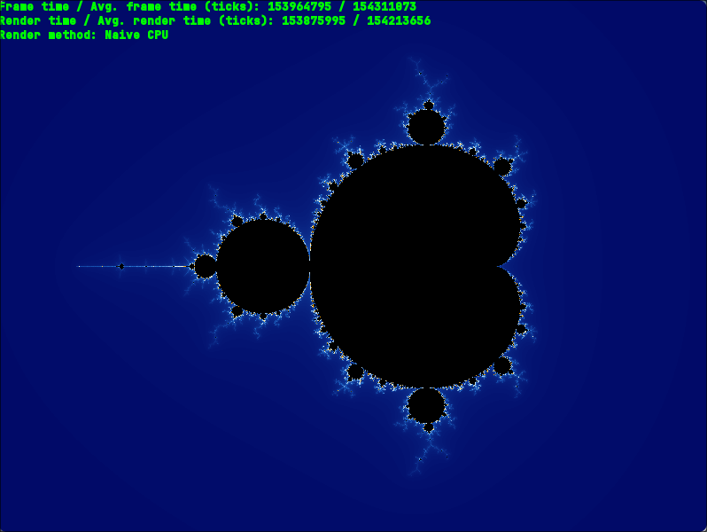
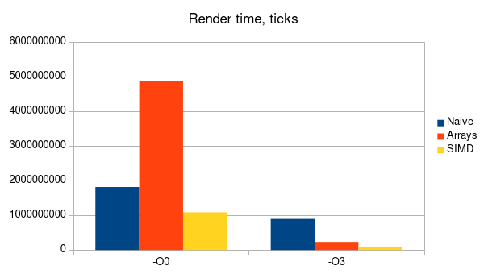

# Рендеринг множества Мандельброта с использованием CPU и GPU

## Введение 
Данный проект реализует несколько из возможных способов рендера двумерных фрактальных фигур (в частности множнства Мандельброта). Целью работы является исследование влияния различных процессорных оптимизаций на скорость отрисовки изображения и сравнение эффективности рендеринга на процессоре и видеокарте.

## Скачивание и установка

> [!IMPORTANT]
> Эта программа предназначена для исполнения на системах с архитектурой x86_64 tigerlake и Linux в качестве ОС. Стабильная работа при ручном изменении параметров компиляции (или запуске на системах с другой архитектурой / ОС) не гарантируется.

Для скачивания и сброрки программы в примере ниже используются утилиты [`git`](https://git-scm.com/), [`cmake`](https://cmake.org/) и [`ninja`](https://ninja-build.org/). Допускается изменение системы сборки `ninja` на любую другую, поддерживаемую CMake, при помощи параметра командной строки `-G <generator name>`. Для корректного функционирования и сборки программы необходима установленная на компьютере библиотека [`sfml`](https://www.sfml-dev.org/index.php).

``` bash
> git clone git@github.com:Iprime111/Mandelbrot.git
> cd Mandelbrot
> mkdir build && cd build
> cmake .. -DCMAKE_BUILD_TYPE=Release -GNinja
> ninja
```

Собранная программа находится по адресу `.../bin/Mandelbrot`

## Внешний вид и горячие клавиши
Интерфейс запущеной программы включает в себя информацию о:
1) *Текущем* и *среднем* значениях **кадров в секунду**
2) *Текущем* и *среднем* значениях **времени рендера одного кадра**
3) Выбранном **методе рендера**




В программе присутствует возможность динамической смены метода отрисовки и раскраски множества, а также поддерживается перемещение и изменение масштаба фигуры.

> [!NOTE]
> При отрисовке изображения на GPU смена раскраски недоступна из-за ограничений языка glsl

Ниже приведен список горячих клавиш, используемых программой:

Клавиша|Действие
:-----:|:-------
W / ↑  | Сдвиг вверх
S / ↓  | Сдвиг вниз
A / ←  | Сдвиг влево
D / →  | Сдвиг вправо
\+     | Увеличение изображения
\-     | Уменьшение изображения
J      | Предыдущий метод рендера
K      | Следующий метод рендера
H      | Предыдущая раскраска
L      | Следующая раскраска

## Обзор методов отрисовки
На выбор пользователю доступны 4 метода отрисовки изображения:

1) **Наивный рендеринг на процессоре** - данная реализация использует двойной цикл для прохода по каждому из пикселей изображения и выбора цвета для него.
2) **Рендеринг с оптимизациями на массивах** - метод использует массивы для отрисовки групп по 16 пикселей, что позволяет компилятору с флагом `-O3` использовать SIMD оптимизации, ускоряющие выполнение кода.
3) **Рендеринг с использованием SIMD intrinsic** - в этом варианте функции отрисовки используются avx512 intrinsic методы, что позволяет добиться большей оптимизации, чем при неявном использовании avx512 инструкций компилятором.
4) **Рендеринг на фидеокарте** - использует glsl шейдер, выполняющий алгоритм отрисовки, что позволяет ускорить исполнение в несколько тысяч раз.

##  Измерения
Ниже приведены таблицы с результатами средних значений FPS и времени рендера кадра для каждого из методов при разных оптимизациях. Каждое из значений измерялось 3 раза (запуска программы) с последующим усреднением результатов. При каждом из измерений масштаб изображения и положение камеры были одинаковыми. Для снятия средних значений был использован размер выборки в 300 циклов отрисовки:

### FPS

Уровень оптимизации / Метод рендера | Naive | Array | SIMD | GPU
------------------------------------|-------|-------|------|-----
`-O0`                               | 3 | 1 | 6 | ~20.000
`-O3`                               | 9 | 27 | 74 | ~20.000


### Время рендера

Уровень оптимизации / Метод рендера | Naive | Array | SIMD | GPU
------------------------------------|-------|-------|------|-----
`-O0`                               | 227 | 630 | 145 | ~0
`-O3`                               | 109 | 34 | 12 | ~0



> [!NOTE]
> Измерения времени проводились при помощи функции `clock_gettime()` стандартной библиотеки C, так как она дает большую точность по сравнению с `clock()` на POSIX-совместимых системах.

## Выводы

Из гистограмм явно видно, что без флага `-O3` компилятор не использует SIMD инструкции, из-за чего реализация рендера на массивах работает медленнее наивной. Также четко заметно, что при обоих уровнях оптимизации, использование intrinsic функций повышает производительность (в ~2.0 раза на `-O0` и в ~8.2 раза на `-O3` по сравнению с нативной реализацией). При этом скорость рендера на видеокарте на несколько порядков выше, чем на CPU и реальное значение скорости отрисовки кадра при использовании GPU трудно поддается измерению.


